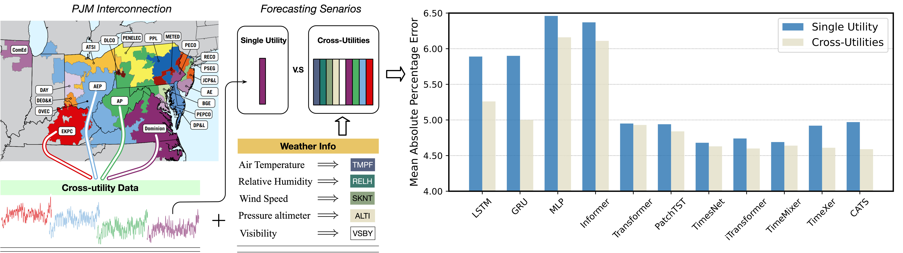

# A Dataset for Day-ahead Power Load Forecasting Based on Multiple Utilities Integration

This repository provides an official **PyTorch** implementation of *CrossUPL: A Dataset for Day-ahead Power Load Forecasting Based on Multiple Utilities Integration.*

<p align="center">
  
</p>

Left: an example of single utility and cross-utilities forecasting senarios on PJM dataset. Right: benefits (in terms of
MAPE over baseline models) of using multiple utilities dataset in short-term load forecasting

### Python environment setup with Conda
---
```bash
# create conda virtual enviroment
conda create --name crossupl python=3.10.16

# activate environment
conda activate crossupl

# pytorch 
pip install torch==2.5.1 torchvision==0.20.1 torchaudio==2.5.1 --index-url https://download.pytorch.org/whl/cu121
```

###  Data Preparation
---
Note that, here we provided a small sample of PJM dataset for testing. For full dataset, please visit [Google Drive](https://drive.google.com/file/d/1odN4IU3fVwMpF1o0oNYxRa5gHSV_lebL/view?usp=sharing)


**Your Own Data:** To use your own data with CrossUPL, you will need a file containing the historical power load time series data. Example can be found in ./dataset/PJM_OT_data.csv


### How to start
---
#### 1. For single utility forecasting

```shell
python run.py --learning_rate 0.001 --is_training 1 --root_path ./dataset/ --data_path PJM_OT_data.csv --model_id PJM --model TimesNet --data PJM_OT --pjm_sub_name AE --features S --seq_len 7 --label_len 2 --pred_len 1 --e_layers 1 --d_layers 1 --factor 2 --enc_in 1 --dec_in 1 --c_out 1 --d_model 128 --d_ff 64 --des 'Exp' --itr 1 --top_k 5  --sub_train --time_train
```

#### 2. For cross-utilities forecasting

```shell
python run.py --learning_rate 0.001 --is_training 1 --root_path ./dataset/ --data_path PJM_OT_data.csv --model_id PJM --model TimesNet --data PJM_OT --pjm_sub_name AE --features MS --seq_len 7 --label_len 2 --pred_len 1 --e_layers 1 --d_layers 1 --factor 2 --enc_in 19 --dec_in 19 --c_out 19 --d_model 128 --d_ff 64 --des 'Exp' --itr 1 --top_k 5  --sub_train --time_train
```

#### 2. For forecasting with temperature

```shell
python run.py --learning_rate 0.001 --is_training 1 --root_path ./dataset/ --data_path PJM_OT_data.csv --model_id PJM --model TimesNet --data PJM_OT --pjm_sub_name AE --features MS --seq_len 7 --label_len 2 --pred_len 1 --e_layers 1 --d_layers 1 --factor 2 --enc_in 2 --dec_in 2 --c_out 2 --d_model 128 --d_ff 64 --des 'Exp' --itr 1 --top_k 5  --weather_train --time_train
```

### Acknowledgement
---
This library is constructed based on the following repos:
* Time-Series-Library: https://github.com/thuml/Time-Series-Library
* CATS (ICML 2024): https://github.com/LJC-FVNR/CATS 
* TimeXer ((NeurIPS 2024): https://github.com/thuml/TimeXer
